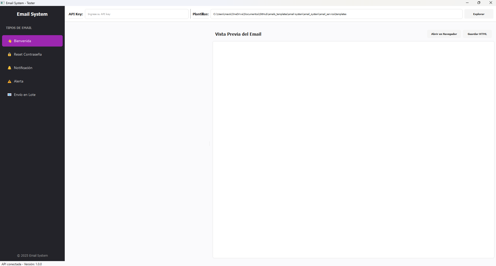

# Sistema de Emails API

Un sistema completo de envío de emails con arquitectura moderna basada en FastAPI, plantillas HTML responsivas, y una aplicación de prueba con GUI.



## ✨ Características

- 🚀 API RESTful construida con FastAPI y Pydantic
- 📧 Múltiples tipos de emails (bienvenida, restablecimiento de contraseña, notificaciones, alertas)
- 🎨 Plantillas HTML responsivas con estilos modernos y procesamiento inline
- 🔄 Soporte para envío de emails en lote
- 🔒 Autenticación mediante API Key
- 🎯 Personalización de contenido por destinatario
- 📱 Diseño adaptable a dispositivos móviles
- 🌐 Integración con el servicio de Resend para envío confiable
- 🖥️ Aplicación GUI para pruebas con vista previa en tiempo real

## 📋 Requisitos

- Python 3.8+
- Cuenta en [Resend](https://resend.com) para el envío de emails
- Paquetes Python (ver `requirements.txt`)

## 🏗️ Estructura del Proyecto

```
email-system/
├── README.md                    # Documentación principal
├── requirements.txt             # Requisitos de instalación
├── setup.py                     # Para empaquetado e instalación
├── .env.example                 # Template para archivo .env
├── email_system/                # Paquete principal
│   ├── api/                     # API backend
│   │   ├── main.py              # Aplicación FastAPI
│   │   ├── dependencies.py      # Dependencias FastAPI
│   │   └── routes/
│   │       └── email_routes.py  # Rutas de API para emails
│   ├── client/                  # Cliente GUI
│   │   ├── main.py              # Punto de entrada
│   │   ├── config.py            # Configuración cliente
│   │   ├── components/          # Componentes UI
│   │   │   ├── forms.py         # Formularios
│   │   │   ├── preview.py       # Vista previa
│   │   │   ├── sidebar.py       # Barra lateral
│   │   │   └── main_window.py   # Ventana principal
│   │   └── utils/
│   │       └── api_client.py    # Cliente para la API
│   ├── core/                    # Lógica central
│   │   ├── config.py            # Configuración global
│   │   ├── models.py            # Modelos de datos
│   │   └── exceptions.py        # Excepciones centralizadas
│   └── email_service/           # Servicio de email
│       ├── service.py           # Implementación servicio
│       ├── templates/           # Plantillas HTML
│       │   ├── base.html
│       │   ├── welcome.html
│       │   ├── password_reset.html
│       │   ├── notification.html
│       │   └── alert.html
│       ├── types/              # Tipos de email
│       │   ├── base.py         # Clase base email
│       │   └── templates.py    # Implementaciones
│       └── utils/
│           └── validation.py   # Validación de emails
└── tests/                      # Pruebas
```

## 🛠️ Instalación

### Instalación para desarrollo

1. Clona el repositorio:

```bash
git clone https://github.com/nup2112/email-system.git
cd email-system
```

2. Crea y activa un entorno virtual:

```bash
python -m venv venv
source venv/bin/activate  # En Windows: venv\Scripts\activate
```

3. Instala las dependencias:

```bash
pip install -r requirements.txt
```

4. Instala el paquete en modo desarrollo:

```bash
pip install -e .
```

### Instalación con Pydantic v2+

Si usas Pydantic v2 o superior, asegúrate de instalar `pydantic-settings`:

```bash
pip install pydantic-settings
```

## ⚙️ Configuración

1. Crea un archivo `.env` en la raíz del proyecto basado en `.env.example`:

```
# API Key para la autenticación de la API
API_KEY=tu_api_key_secreta

# API Key para el servicio de Resend
RESEND_API_KEY=tu_api_key_de_resend

# Configuración del remitente por defecto
DEFAULT_FROM_EMAIL=no-reply@tudominio.com
DEFAULT_FROM_NAME=Tu Empresa

# Modo de desarrollo (true/false)
DEBUG=false

# Modo de pruebas (no envía emails realmente)
TESTING=false
```

2. Personaliza las plantillas HTML en la carpeta `email_system/email_service/templates` según sea necesario.

## 🚀 Uso

### Iniciar el servidor API

```bash
# Desde la raíz del proyecto
python -m email_system.api.main

# O desde dentro del directorio api
cd email_system/api
python main.py
```

El servidor estará disponible en `http://localhost:8000`.

### Iniciar la aplicación GUI

```bash
# Desde la raíz del proyecto
python -m email_system.client.main

# O desde dentro del directorio client 
cd email_system/client
python main.py
```

Para iniciar con parámetros personalizados:

```bash
python -m email_system.client.main --api-url http://localhost:8000/api --api-key tu_api_key --templates-dir path/to/templates
```

### Documentación interactiva

Accede a la documentación interactiva de la API en:

- Swagger UI: `http://localhost:8000/docs`
- ReDoc: `http://localhost:8000/redoc`

## 📮 Ejemplos de uso programático

### Enviar un email de bienvenida

```python
import requests
import json

url = "http://localhost:8000/api/emails/welcome"
headers = {
    "X-API-Key": "tu_api_key",
    "Content-Type": "application/json"
}
payload = {
    "company": {
        "name": "Mi Empresa",
        "address": "Calle Principal 123",
        "support_email": "soporte@miempresa.com",
        "website": "https://miempresa.com",
        "social_media": {
            "facebook": "https://facebook.com/miempresa",
            "twitter": "https://twitter.com/miempresa"
        },
        "logo_url": "https://miempresa.com/logo.png"
    },
    "user": {
        "email": "usuario@ejemplo.com",
        "name": "Juan Pérez"
    },
    "query": {
        "dashboard_url": "https://miempresa.com/dashboard"
    }
}

response = requests.post(url, headers=headers, data=json.dumps(payload))
print(response.json())
```

### Enviar emails en lote

```python
import requests
import json

url = "http://localhost:8000/api/emails/batch"
headers = {
    "X-API-Key": "tu_api_key",
    "Content-Type": "application/json"
}
payload = {
    "email_type": "notification",
    "company": {
        "name": "Mi Empresa",
        "address": "Calle Principal 123",
        "support_email": "soporte@miempresa.com",
        "website": "https://miempresa.com",
        "logo_url": "https://miempresa.com/logo.png"
    },
    "recipients": [
        {"email": "usuario1@ejemplo.com", "name": "Usuario Uno"},
        {"email": "usuario2@ejemplo.com", "name": "Usuario Dos"},
        {"email": "usuario3@ejemplo.com", "name": "Usuario Tres"}
    ],
    "query": {
        "title": "Nueva actualización disponible",
        "message": "Hemos lanzado nuevas funciones en nuestra plataforma.",
        "type": "info",
        "action_url": "https://miempresa.com/novedades",
        "action_text": "Ver novedades",
        "preferences_url": "https://miempresa.com/preferencias"
    }
}

response = requests.post(url, headers=headers, data=json.dumps(payload))
print(response.json())
```

## 📡 Endpoints de la API

| Método | Endpoint | Descripción |
|--------|----------|-------------|
| POST | `/api/emails/batch` | Envía emails personalizados a múltiples destinatarios en un lote |
| POST | `/api/emails/welcome` | Envía un email de bienvenida |
| POST | `/api/emails/password-reset` | Envía un email de restablecimiento de contraseña |
| POST | `/api/emails/notification` | Envía un email de notificación |
| POST | `/api/emails/alert` | Envía un email de alerta |
| GET | `/health` | Comprueba el estado de la API |

## 🧩 Arquitectura

El sistema está organizado en capas siguiendo los principios de Clean Architecture:

1. **Core**: Modelos de datos y configuración central
2. **Email Service**: Lógica de negocio para generar y enviar emails
3. **API**: Interfaces de comunicación REST
4. **Client**: Aplicación de prueba con interfaz gráfica

Cada componente tiene responsabilidades bien definidas, lo que facilita las pruebas y el mantenimiento.

## 🔧 Solución de problemas comunes

### Error: ModuleNotFoundError: No module named 'email_system'

Si encuentras este error al ejecutar los scripts directamente, asegúrate de haber instalado el paquete en modo desarrollo:

```bash
pip install -e .
```

### Error: Pydantic BaseSettings ha sido movido

Si usas Pydantic v2 y recibes un error sobre `BaseSettings`, instala pydantic-settings:

```bash
pip install pydantic-settings
```

### La interfaz gráfica se inicia con una pantalla en blanco

Si la interfaz gráfica se inicia con un área principal en blanco pero funciona al hacer clic en elementos de la barra lateral, verifica que la inicialización de la vista por defecto esté funcionando correctamente en `main_window.py`.

## 🛡️ Seguridad

- Asegúrate de proteger tu API_KEY y no incluirla en control de versiones
- Usa HTTPS en entornos de producción
- Valida siempre los emails entrantes para prevenir inyecciones

## 📄 Licencia

Este proyecto está licenciado bajo la Licencia MIT - ver el archivo LICENSE para más detalles.

## 👥 Contribuciones

Las contribuciones son bienvenidas. Por favor, abre un issue para discutir cambios importantes antes de enviar un pull request.

1. Haz fork del proyecto
2. Crea una rama para tu feature (`git checkout -b feature/nombre-feature`)
3. Haz commit de tus cambios (`git commit -am 'Añadir nueva funcionalidad'`)
4. Haz push a la rama (`git push origin feature/nombre-feature`)
5. Abre un Pull Request